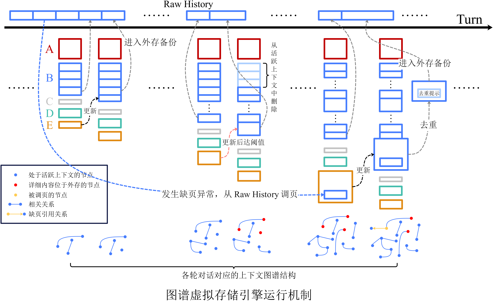

# Graph Coding Agent


本项目是一个完全基于 Python 语言、从零构建、无任何第三方 Agent 框架依赖的智能编程系统。

针对传统 Agent 系统在长周期、重度代码编辑场景中面临的**上下文溢出与遗忘**、**编程计划设计困难**、**编程错误累积**和**编程自由探索度较弱**等问题，本项目引入了**图**与**操作系统内存管理**的思想，构建了具备**缺页中断调入**、**基于 Git 的全景分支回退**和**工具场景化**等特性的高可靠代码智能体。

---


## 一、 系统架构概览

本项目严格遵循高内聚低耦合的设计哲学，核心模块分层如下

```text
coding-agent/
├── core/                 ## 主控核心层
│   ├── __init__.py
│   └── agent.py          # 负责完整的生命周期调度，监控上下文阈值触发缺页换出、处理分支回溯操作
│
├── memory/               ## 存储管理层 (MMU)
│   ├── __init__.py
│   ├── graph_notepad.py  # 上下文图谱管理：负责上下文与上下文图谱的映射，完成“缺页”异常处理
│   └── engineering_graph.py  # 任务图谱管理：负责管理 LLM 设计的任务网络，完成任务网络到文件网络的映射
│
├── toolchain/            ## 工具层
│   ├── __init__.py
│   ├── tools.py          # 基础工具库：包括文件处理、shell 命令执行等功能的多个工具
│   └── dynamic_tools_manager.py # 自定义工具管理：管理 LLM 生成的自定义工具
│
├── gateway/              ## API 适配层
│   ├── __init__.py
│   └── llm_client.py     # 负责通过各厂商提供的接口调用 LLM 服务
│
└── main.py               # 入口模块，负责管理 CLI，提供与 Agent 的交互界面
```


## 二、 核心架构创新与机制解析

### 1. 图谱虚拟存储引擎

传统 Agent 在面临内存（Token）上限时通常采用**线性截断**、**摘要机制**或**概率匹配的向量检索**，这可能会导致缺失部分细节，甚至灾难性遗忘。为了解决这一问题，本系统参考**虚拟存储机制**的实现方式，引入了内存管理单元（MMU）理念。

* **结构化上下文图谱**：将 LLM 的历史上下文重构为**上下文图**，每个节点记录本次对话的**任务、结果和关键细节**，这些信息由 LLM 在**每轮对话末尾由 \<XML> 格式总结**，利用 Agent 后台函数处理成上下文图的节点；此外，每个节点还包含了 `in_Context、commit_hash、turn_index` 等属性，具体结构如下

  ```json
  {
      "task": "创建 hello.py 并运行验证",
      "result": "成功输出 Hello, World!",
      "core_details": "用 Python 编写了标准 hello world 程序，包含 main 函数和入口判断，运行验证无误。",
      "turn_index": 1,
      "commit_hash": "1d4f87f2c8abb77d591f38cee7266ea901442613",
      "in_Context": true,
      "id": "Node_1"
  }
  ```

* **内存动态换出**：当提供给 LLM 的上下文（**活跃上下文**）**达到设定阈值**时，系统**触发页换出**操作，将早期上下文从当前活跃上下文中截断，并在**上下文图谱的对应节点将 in_Context 标记为 `[Evicted]`**，让活跃上下文大小恢复至最大上下文大小的 50%。
* **缺页重载**：为大模型提供的活跃上下文**包含了上下文图谱**，大模型据此可以了解上下文节点 **in_Context 状态**。当推理过程需要调用被换出的历史细节时，模型可主动调用 `expand_node` 工具触发“**缺页中断**”。系统将顺着链接指针**寻址数十兆的外存日志**，精准提取原始上下文**重载至当前活跃上下文中**，并将历史细节对应上下文节点的 in_Context **从 `[Evicted]` 更改为 `[pointer to Node_ID]`**，让 LLM 后续不必再重复调用缺页异常函数，从 in_Context 指向处寻找即可。
* **外存自适应全量存储**：对于使用过 `expand_node` 工具的上下文，为了防止指数级增长，会在存储进外存时删去调取的历史上下文信息，保留简短提示，消除了重复和上下文指数增长。
* **引用节点内存动态换出**：如果被换出的是使用过 `expand_node` 工具的上下文，除了标准的操作，还需要**遍历上下文图谱**，将被引用的上下文节点的 in_Context **重新置为 `[Evicted]`**

通过以上的步骤，我们在剩余上下文存储空间不足时，既保留了完整的上下文结构和内容，由提供了解细节的方式，从而**避免了部分记忆缺失或者灾难性遗忘**


### 2. 基于任务、文件层次图的协同推理机制

为防止大模型在大型代码库中产生修改遗漏或陷入无限重试的**局部死循环**，又不至于在搭建好长线大型任务网后，由于前期一个子任务的错误评估**导致整个计划失效**。系统构建了 2-Hop 的任务网络与`Task` $\rightarrow$ `File` 的映射
* **2-Hop 任务网**：每次大模型决策前，系统会在其上下文视野中高亮渲染当前工程任务网的状态贴片。同时限定 LLM 从当前任务触发设计仅包含两跳的未来任务网络。当出现当前任务无法完成时，只需要改动少量规划信息即可。
* **任务、文件映射**：当 LLM 完成了当前任务，Agent 后台函数会自动将处理当前任务时变动的文件建立文件节点，并于当前任务节点建立联系。


### 3. Git 全景探索机制和错误处理方案

代码的**演进往往是非线性的**，但是传统 Agent 的任务处理流程大多是**线性的**，难以完成较为广泛的技术探索，如果强制进行广泛探索反而会导致**上下文相互干扰**。此外，传统 Agent 在发生**错误**后，需要**继续输入提示词要求** LLM 改回原本代码，这极易上下文与代码的对应关系混乱。部分 Agent 使用 git 进行回溯，但是也仅限于一步，对于**已经累计的问题**，它们通常难以解决。
* 本系统将 Agent 的**上下文图谱**与底层的**Git 物理快照**实现了强同步绑定。系统不仅自动接管代码的 Add 与 Commit 流程，更为时间线提供细致的管理。
* **全景探索**：通过 `/fork <N> <分支名>`，用户可以在**任意历史上下文处开辟新分支**，新分支只会继承指定上下文及以前的记忆，且与主支完成**隔离**，代码也会相应回溯到对应位置，用户可以**尝试不同于主支的操作**。
* **错误处理**：用户可通过 `/rollback <N>` **彻底废弃错误时间线**，回溯到自行指定的上下文处，此时提供给 LLM 的上下文与代码均会**同步回溯**
* **时空断点同步**：在触发时空回溯时，系统会自动完成**底层文件的重置**（git reset/checkout）、**活跃上下文截断**以及**外存日志（JSONL）的安全裁切**。尤为特殊的是，若目标节点已被**换出活跃上下文**，回溯脚本会自动从外部存储中**执行连续的页调入**，确保图谱状态位与代码环境的绝对物理同步。


### 4. 场景特化的动态工具自设计

静态的预设工具链无法应对无限边界的真实开发需求。本系统赋予了 Agent **场景适应能力**
* 系统内置了高度隔离的 Python 执行沙盒。在面对特殊任务（如异构日志分析、特定的网页爬虫等）时，大模型可**自行编写可重复使用的、符合当前场景的** Python 代码工具。
* 核心引擎通过 `exec()` 在运行时将脚本**动态挂载**进系统的局部名称空间，并利用 Python 底层的 `inspect.signature` 抽象语法分析机制，自动提取新函数的参数签名与注释说明。
* 系统随即将其编译为符合 API 规范的 JSON Schema，在微小延迟后便将新工具挂载回大模型的工具列表中，实现了**运行时工具链的场景自适应**。


## 三、 智能体控制流详细解析

当系统接收到自然语言任务后，将遵循以下严密的内部循环

1. **上下文组装 (Context Assembly)**：
   提取预设的**系统提示词**（System Prompt），结合**活跃上下文**（Active Memory）、**当前的任务-文件层次网络**（Engineering DAG），以及**上下文图谱**（Context Graph），形成完整 Prompt。
2. **推理与指令分发 (Reasoning & Dispatch)**：
   LLM 解析图谱与代码环境，决定直接**生成代码补丁或调用工具**。文件修改严格限定使用基于正则定位的**区块替换**（Chunk Replacement），避免全量覆写造成的大规模幻觉。
3. **输出流解析 (Stream Parsing)**：
   引擎通过正则系统拦截模型输出的 `<graph_update>` 与 `<plan_network>` 等 XML 格式标记，将自然语言意图反序列化为**两类图谱**。
4. **状态持久化 (Persistence Sync)**：
   自动生成带有上下文哈希与任务明细的描述，通过 Git 固化代码快照，并将新增节点推入**上下文图谱**中，更新外存日志，完成单次周期的闭环。


### 1. 上下文控制

无论是 Anthropic 的 Prompt Caching，还是 DeepSeek 的 Prefix Caching，它们底层的技术原理都是 **KV Cache**。这种机制对 Prompt 的**排列顺序和内容一致性**有着极其严苛的要求，为了能最大限度实现**缓存命中**，我们对上下文结构做如下设计。

#### 上下文的组成

从上至下有 **5 大部分**，越考上的上下文，出现变动的机率越小，保证最大程度实现缓存命中

| 代号 | 内容                                                      | 说明                                                         |
| :--: | --------------------------------------------------------- | ------------------------------------------------------------ |
|  A   | System Prompt, Tool Definitions, 项目基础背景             | 极大概率不变                                                 |
|  B   | 对话历史记录                                              | 相对稳定，初期不断增长，达到阈值时进行处理                   |
|  C   | 用户的额外习惯，可能包括代码习惯，用户希望的LLM回答风格等 | 相对稳定，缓慢增长，由每次的用户最新指令进行提取，可交由小模型完成，且无需上下文，只需将单次用户输入交由小模型进行提取即可（可选项，非必要） |
|  D   | 结构化上下文图谱, 任务、文件层次图                        | 相对稳定，会极其缓慢的增长，不过图存储方式特殊，无法缓存命中，故放于此 |
|  E   | 用户的最新指令, 刚刚调用的工具返回结果, LLM的输出         | 高频更新，每次基本上都会变化，无法缓存命中                   |





#### 上下文的更新

如上图所示，本次对话的上下文 $A_tB_tC_tD_tE_t$ 应当由**上一次的上下文更新**得到，具体地 

| 更新方式                                                  | 说明                                                         |
| :-------------------------------------------------------- | ------------------------------------------------------------ |
| $A_t = A_{t-1}$                                           |                                                              |
| $B_t = B_{t-1} \ \text{concat} \ E_{t-1}$                 | 可能触发上下文压缩，具体内容由[图谱虚拟存储引擎](##1-图谱虚拟存储引擎)描述 |
| $C_t = C_{t-1} \ \text{concat} \ \text{extract}(E_{t-1})$ |                                                              |
| $D_t = D_{t-1}$ 进行增量更新                              | 由[图谱虚拟存储引擎](##1-图谱虚拟存储引擎)、[基于任务、文件层次图的协同推理机制](##2-基于任务、文件层次图的协同推理机制)描述 |
| $E_t =$ 最新输入输出，一般和 $E_{t-1}$ 无关               |                                                              |


### 2. 调度与推理控制

#### 任务网络与文件网络协同

大模型在执行具体的物理修改前，必须先在宏观抽象层面**规划 2-Hop 的 <goal>任务节点**，并声明其先后**依赖关系** <depends>。随后，通过 <file>标签将抽象任务与具体的物理文件深度挂载绑定，强制收束大模型的注意力，有效避免了其在复杂的工程目录中迷失方向或陷入逻辑脱节。

#### 循环终止条件

为了防止大模型在复杂任务中陷入无限试错或自我循环，系统设计了合适的**边界约束机制**。当大模型清空了 tool_calls 队列，即不再需要调用任何外部工具，并且未触发断点续写时，引擎会判定**逻辑收敛**。此外，用户可以通过**拒绝 Agent 的工具调用请求，并附上相应的拒绝理由**，则可影响 LLM 快速进行逻辑收敛。

#### 基于 XML 拦截的旁路状态

在标准的文本对话流之外，系统构建了一条独立于自然语言的“旁路控制流”。引擎会在大模型输出流抵达显存持久化层之前，通过正则引擎预先拦截所有由 XML 标签（如<graph_update>、<plan_network>）包裹的结构化数据。这些元数据被反序列化后，将绕过常规的对话组装区，直接穿透至底层驱动内存图谱与任务拓扑的状态扭转，实现了数据面与控制面的高度解耦。


### 3. IO 控制

#### Tool 的调用

Agent 在与物理环境进行 IO 交互时，针对文件层，摒弃了高风险的全量覆写，强制模型使用带有精确行号与内容锚点的**块级替换**；针对 Shell 终端执行，系统在底层对标准输出进行深度的 ANSI **清洗**，阻断了冗长的乱码终端流对大模型 Token 空间的不可逆污染。

系统 IO 接收层并非单纯等待模型输出结束，而是支持对生成的  JSON 参数堆栈进行强类型推断与**异常捕获**。一旦在工具调用的反序列化阶段识别到非法的 JSON 格式、参数幻觉或必填项遗漏，IO 控制器**不会引发系统级崩溃**，而是将底层异常转化为**结构化的提示字符串**，重定向注入回模型的输入端，引导其利用自身逻辑完成自我修复。

#### 无感长链接强制拼接

针对大模型在输出超长重构代码时必定触发的 max_tokens 长度截断缺陷，本系统的底层网关实现了一套底层的“**断点续传**”算法。一旦网关探测到 API 返回的终止状态 finish_reason 为 length，调度器将截获该信号，并在后台静默向大模型下**发续写指令**。网关将前后多次生成的**碎片流进行无缝拼接**后，再整体向上传递，对上层业务流彻底隐藏了长度边界，确保了超大文件 IO 操作的原子性与完整性。


### 4. 问题处理与安全控制

#### 底层 Git 快照防御

系统将运行时的安全基线建立在**版本控制机制**之上。在每一个**逻辑回合闭环**进入休眠前，系统会自动接管工作区的读写状态，静默触发 git add 与 git commit，将当前回合的任务意图、修改的物理文件以及上下文哈希打包固化。即使大模型由于严重幻觉误删了核心业务代码，用户依然能**利用物理快照实现恢复**，构筑了绝对的防御底线。

#### 高危动作的人工审批

对于**可能具有破坏性的运行动作**，Agent 会**强制要求用户审批**。用户可通过终端输入 /type 指令，将 Agent 在“人工审核”和“自动审批”模式之间切换，但不论何种模式，任何涉及 **Shell 脚本执行、文件大范围抹除**等高危动作，调度线程均会被挂起，控制权将交接至终端控制台，必须等待用户进行显式授权后方可执行


## 四、 部署与使用指南

### 1. 环境部署

**[前置要求]** Python 3.10 或更高版本。

```bash
# 配置环境变量
echo "OPENAI_API_KEY=your-api-key-here" > .env
echo "BASE_URL=https://api.openai-compatible-endpoint.com" >> .env

# 安装基础依赖
pip install -r requirements.txt

# 启动智能体
cd <Work_Directory>
python <Code_Directory>/main.py
```

> 启动 coding agent 时如果当前目录下没有 agent 的核心代码，请自行**配置环境变量**或者**使用绝对/相对路径调用main.py**


### 2. 工作目录相关内容

当 `main.py` 在一个新项目中首次运行时，会在根目录自动注入一系列工程文件。这些文件构成了 Agent 的局部运行沙盒，并且完全静默运行，避免污染用户的任务代码

```text
user_project_root/
├── .agent_sessions/    # 存放图谱拓扑记忆、不同会话的独立上下文以及容量庞大的原始上下文数据
├── .dynamic_tools/     # 大模型自定义工具，工作目录内共享
├── .git/               # git 相关信息存储
├── .agent_tasks.json   # 存储任务网络及其到文件的映射
└── .gitignore          # 自动配置敏感文件的静默隔离规则，防止凭据与运行日志意外泄露
```

* **`.agent_sessions/`** 存储了当前工作目录下与 agent 的全部会话，每个会话对应一个文件夹，文件夹中保存 `graph.json`, `history.json`, `history_raw.jsonl` 三个文件，分别存储**上下文图谱**、**LLM缓存的历史记录**、**全量的原始历史记录**
* **`.dynamic_tools/`** 存储了当前工作目录下，agent 创建的全部自定义工具，以 `<tool_name>.py`, `<tool_name>.json` 形式成对出现，分别是**工具的代码实现**和**提供给 LLM 的工具描述**
* **`.agent_tasks.json`** 存储了 LLM 规划的**任务网络**，并记录了**任务到具体文件实现的映射**


## 五、未来展望

### 1. AST 语法树解析

在 [基于任务、文件层次图的协同推理机制](##2-基于任务、文件层次图的协同推理机制) 部分，我们探讨了任务如何与文件协同，提高任务完成的效率，实际上这也使 LLM **不会出现对当前文件夹的文件结构产生幻觉**。但是，由于调用工具前 LLM 并不清楚文件内实现细节，所有仍有可能在编程时使用了**正确的文件，但是错误的接口**。为了解决这一问题，同时也为了建立文件之间的关联，我们可以构建**抽象语法树 (AST)**，并将 AST 与任务、文件层次图中的文件节点建立关联，升级为**任务、文件、语法层次图**，进一步为 LLM 提供文件之间的关联和文件内部的清晰结构。

> 由于 Coding Agent 应当可以编写全部编程语言的代码，而对每一种编程语言进行 AST 适配实在过于耗时与繁重，于是暂时搁置，未来升级。


### 2. Sub Agent

主要有两种模式，一种是类似客户端服务端 C/S 的模型，另一种是类似 Peer-to-Peer 的模型。

* 关于类 C/S 的子 Agent，它是一种将处理复杂、输出简单的任务进行简单的上下文组装，随后交由一个新的 Agent 完成的技术，主 Agent只是来接收任务的输入和输出，避免影响主 Agent 的上下文。
* 关于类 P2P 的多 Agent，一般是启动多个 Agent，它们各自擅长某样工作，彼此共享部分上下文，具体完成任务时，多 Agent 进行讨论，各自处理相应问题，有时会涌现出较为新颖的做法。

> 由于类 C/S 的子 Agent 主要减少上下文污染，而我们的 [图谱虚拟存储引擎](##1-图谱虚拟存储引擎) 通过上下文图谱可以实现将上下文存储在外存中，只保留输入、输出和关键细节，这与子 Agent 实现不谋而合。
>
> 类 P2P 的多 Agent 有时会陷入多步的循环，导致浪费大量 token，所以需要较为完善的调度机制，于是暂时搁置，未来升级。


## 六、 附录

本项目引用的基础库包括

|            代码库             | 用途                                                         |
| :---------------------------: | :----------------------------------------------------------- |
|         **`openai`**          | 作为基础 HTTP 客户端处理底层的大语言模型流式 API 请求与格式对齐 |
|        **`networkx`**         | 基础数学库，用于支撑图结构的运算、节点寻址与邻接表生成       |
| **`prompt_toolkit` & `rich`** | 提供无阻塞的终端控制台、多行文本输入支持及终端内部的 Markdown 渲染 |
|      **`Python 基础库`**      | \                                                            |